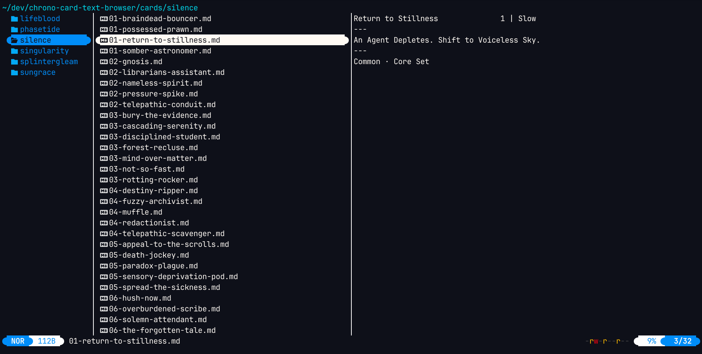
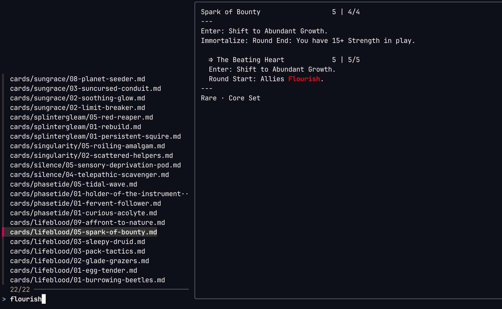

# chrono-card-text-browser

A yazi-browsable plain-text card and deck browser for [Chrono CCG](https://playchrono.com/).

Browse all cards or import a deck and browse just that. Also includes a deck code encode/decode function and a fish function for interactive browsing.

Data provided by [Chrono DB](https://www.chrono-db.net/).

## Browsing

Open `cards/` in [yazi](https://github.com/sxyazi/yazi) to browse all cards by syndicate (directory), sorted by cost (filename prefix). Open `decks/` to browse saved deck directories.



### Searching with `ccb` (Chrono Card Browser)

The `ccb` [fish](https://fishshell.com/) function ([ccb.fish](ccb.fish)) runs a live ripgrep search over card file contents with per-card previews. Source it or add it to your fish config. Dependencies: [`rg`](https://github.com/BurntSushi/ripgrep), [`fzf`](https://github.com/junegunn/fzf). Must be run from repo root.

```fish
ccb                          # browse every card
ccb flourish                 # cards containing "flourish"
ccb 'draw:.*shift'           # full rg regex
ccb -g '03-*'                # all 3-drops, every syndicate
ccb -g 'lifeblood/*'         # everything in Lifeblood
ccb -g 'lifeblood/03-*'      # 3-drops in Lifeblood
ccb -g 'lifeblood/*' evasive # Lifeblood cards containing "evasive"
```

The prompt is a live ripgrep query over card file contents — every keystroke reruns `rg`. The preview pane shows the full matching card. Press Esc to exit.



`-g` scopes the search to a subset of cards; the prompt then filters by content within that scope. Glob paths are relative to `cards/`: a glob with no `/` matches filenames anywhere (`03-*` = all 3-drops across all syndicates); a glob with `/` matches relative paths (`lifeblood/03-*`). Trailing `/` matches nothing — scope a syndicate as `lifeblood/*` not `lifeblood/`.

## Decks

Import a deck code into `decks/` for browsing ([just](https://github.com/casey/just) required):

    just deck CODE NAME

Creates `decks/NAME/` containing a `!index.md` summary and one card file per unique card in the deck, in the same format as the card browser.

Search within a deck with `ccb -d`:

```fish
ccb -d decks/my-deck
ccb -d decks/my-deck flourish
```

## More
See [tools/README.md](tools/README.md) for generating/updating the card browser, the deckcode script, etc. These aren't necessary to browse `cards/` or decks.
